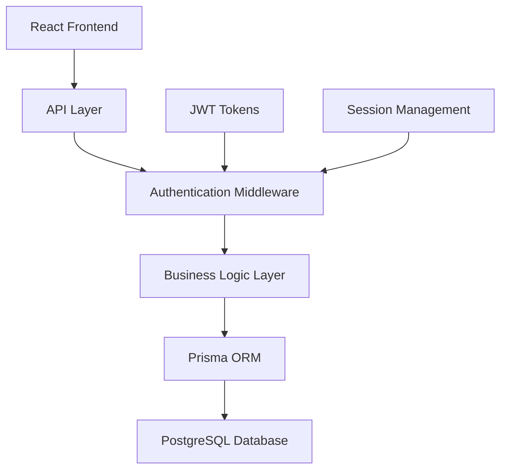

# Backend Integration Design Document

## Overview

This design document outlines the integration of a full-stack backend solution for MyShopKE using Prisma ORM with PostgreSQL database, implementing authentication and authorization systems. The solution will transform the current React frontend into a complete full-stack application while maintaining the existing UI/UX and adding persistent data management.

## Architecture

### High-Level Architecture



### Technology Stack

**Backend Framework**: Node.js with Express.js
**Database**: PostgreSQL 15+
**ORM**: Prisma 5.x
**Authentication**: JWT (JSON Web Tokens) with bcrypt for password hashing
**API Design**: RESTful API with consistent JSON responses
**Validation**: Zod (already in dependencies) for request/response validation
**Environment**: Development and production configurations

### Project Structure

```
backend/
├── prisma/
│   ├── schema.prisma
│   ├── migrations/
│   └── seed.ts
├── src/
│   ├── controllers/
│   ├── middleware/
│   ├── routes/
│   ├── services/
│   ├── types/
│   ├── utils/
│   └── server.ts
├── .env
└── package.json
```

## Components and Interfaces

### Database Schema Design

#### User Management

- **Users Table**: Core user information with role-based differentiation
- **UserProfiles Table**: Extended profile information specific to farmers/buyers
- **Sessions Table**: Active user sessions for security management

#### Marketplace Data

- **ProduceListings Table**: Farmer produce listings with full details
- **Categories Table**: Standardized crop categories
- **Locations Table**: Kenyan counties and regions
- **Interactions Table**: Buyer-farmer communication logs

#### System Data

- **AuditLogs Table**: Security and data access logging
- **UserPreferences Table**: Saved search filters and preferences

### API Endpoints Design

#### Authentication Endpoints

```
POST /api/auth/register
POST /api/auth/login
POST /api/auth/logout
POST /api/auth/refresh
GET  /api/auth/profile
PUT  /api/auth/profile
```

#### Farmer Endpoints

```
GET    /api/farmer/listings
POST   /api/farmer/listings
PUT    /api/farmer/listings/:id
DELETE /api/farmer/listings/:id
GET    /api/farmer/dashboard
```

#### Buyer Endpoints

```
GET  /api/buyer/listings
GET  /api/buyer/listings/search
POST /api/buyer/preferences
GET  /api/buyer/preferences
POST /api/buyer/interactions
GET  /api/buyer/dashboard
```

#### Public Endpoints

```
GET /api/public/categories
GET /api/public/locations
GET /api/public/listings (limited, for landing page)
```

### Authentication Flow

1. **Registration**: User provides email, password, role, and profile information
2. **Login**: Credentials validated, JWT token issued with 24-hour expiry
3. **Token Refresh**: Automatic token renewal for active sessions
4. **Authorization**: Middleware validates tokens and role permissions
5. **Logout**: Token invalidation and session cleanup

## Data Models

### Prisma Schema Structure

```prisma
model User {
  id          String   @id @default(cuid())
  email       String   @unique
  password    String
  role        UserRole
  fullName    String
  phoneNumber String
  isActive    Boolean  @default(true)
  createdAt   DateTime @default(now())
  updatedAt   DateTime @updatedAt

  profile         UserProfile?
  produceListings ProduceListing[]
  interactions    Interaction[]
  preferences     UserPreference[]
  sessions        Session[]
}

model UserProfile {
  id       String @id @default(cuid())
  userId   String @unique
  location String?
  farmSize Float?

  user User @relation(fields: [userId], references: [id])
}

model ProduceListing {
  id           String   @id @default(cuid())
  farmerId     String
  cropType     String
  quantity     Float
  unit         String
  pricePerUnit Float
  harvestDate  DateTime
  location     String
  description  String?
  isActive     Boolean  @default(true)
  createdAt    DateTime @default(now())
  updatedAt    DateTime @updatedAt

  farmer       User          @relation(fields: [farmerId], references: [id])
  interactions Interaction[]
}

enum UserRole {
  FARMER
  BUYER
}
```

### Data Validation Rules

- **Email**: Valid email format, unique across system
- **Password**: Minimum 8 characters, mixed case, numbers, special characters
- **Phone**: Kenyan phone number format validation
- **Prices**: Positive numbers with 2 decimal places
- **Dates**: Future dates for harvest, proper date formats
- **Quantities**: Positive numbers with appropriate units

## Error Handling

### Error Response Format

```typescript
interface ApiError {
  success: false;
  error: {
    code: string;
    message: string;
    details?: any;
  };
  timestamp: string;
}

interface ApiSuccess<T> {
  success: true;
  data: T;
  timestamp: string;
}
```

### Error Categories

1. **Authentication Errors** (401): Invalid credentials, expired tokens
2. **Authorization Errors** (403): Insufficient permissions
3. **Validation Errors** (400): Invalid input data, missing fields
4. **Not Found Errors** (404): Resource doesn't exist
5. **Server Errors** (500): Database issues, unexpected failures

### Error Handling Strategy

- **Global Error Middleware**: Catches and formats all errors consistently
- **Async Error Wrapper**: Handles promise rejections in route handlers
- **Database Error Translation**: Converts Prisma errors to user-friendly messages
- **Logging**: All errors logged with context for debugging

## Security Implementation

### Password Security

- **Hashing**: bcrypt with salt rounds of 12
- **Validation**: Strong password requirements enforced
- **Storage**: Never store plain text passwords

### JWT Token Security

- **Signing**: HS256 algorithm with strong secret key
- **Expiry**: Short-lived access tokens (24 hours)
- **Refresh**: Secure refresh token mechanism
- **Storage**: HttpOnly cookies for web security

### API Security

- **CORS**: Configured for frontend domain only
- **Rate Limiting**: Prevent brute force attacks
- **Input Sanitization**: All inputs validated and sanitized
- **SQL Injection Prevention**: Prisma ORM provides protection

### Data Protection

- **Environment Variables**: All secrets in environment files
- **Database Encryption**: Sensitive data encrypted at rest
- **HTTPS**: All communications over secure connections
- **Audit Logging**: Track all data access and modifications

## Testing Strategy

### Unit Testing

- **Controllers**: Test all API endpoints with mock data
- **Services**: Test business logic with various scenarios
- **Middleware**: Test authentication and authorization flows
- **Utilities**: Test helper functions and validators

### Integration Testing

- **Database Operations**: Test Prisma queries and mutations
- **API Endpoints**: End-to-end API testing with test database
- **Authentication Flow**: Complete login/logout/refresh cycles
- **Error Scenarios**: Test error handling and edge cases

### Performance Testing

- **Database Queries**: Optimize slow queries with indexing
- **API Response Times**: Ensure sub-200ms response times
- **Concurrent Users**: Test system under load
- **Memory Usage**: Monitor for memory leaks

### Security Testing

- **Authentication**: Test token validation and expiry
- **Authorization**: Verify role-based access controls
- **Input Validation**: Test with malicious inputs
- **SQL Injection**: Verify Prisma protection works

## Development Workflow

### Environment Setup

1. **PostgreSQL**: Local development database setup
2. **Prisma**: Database schema migration and seeding
3. **Environment Variables**: Development and production configs
4. **API Documentation**: OpenAPI/Swagger documentation

### Database Management

- **Migrations**: Version-controlled schema changes
- **Seeding**: Sample data for development and testing
- **Backup Strategy**: Regular database backups
- **Performance Monitoring**: Query performance tracking

### Deployment Strategy

- **Environment Separation**: Development, staging, production
- **Database Migrations**: Automated migration deployment
- **Environment Variables**: Secure secret management
- **Health Checks**: API and database health monitoring

## Integration with Existing Frontend

### API Client Setup

- **Axios Configuration**: Base URL, interceptors, error handling
- **Authentication Integration**: Token storage and refresh logic
- **Error Handling**: User-friendly error messages
- **Loading States**: Proper loading indicators

### State Management Updates

- **User State**: Authentication status and user profile
- **Data Fetching**: Replace mock data with API calls
- **Caching**: Implement proper data caching strategies
- **Optimistic Updates**: Better user experience with optimistic UI

### Route Protection

- **Protected Routes**: Require authentication for certain pages
- **Role-Based Access**: Different features for farmers vs buyers
- **Redirect Logic**: Proper navigation after login/logout
- **Session Management**: Handle expired sessions gracefully

This design provides a robust, secure, and scalable backend solution that integrates seamlessly with the existing React frontend while adding the requested authentication, authorization, and data persistence capabilities.
